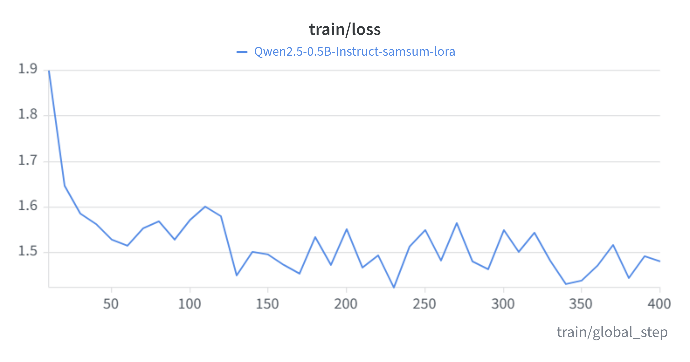

# dialogue-summarizer-lora


Fine-tune a small open LLM to summarize chat conversations, then serve it behind a REST API — end to end, on free hardware.

A **Qwen2.5-0.5B-Instruct** base model is adapted with **LoRA** on the [SamSum](https://huggingface.co/datasets/knkarthick/samsum) messenger-dialogue dataset. Training runs on a free Colab T4; the resulting adapter is a small fraction of the base model's parameters and is served on CPU via FastAPI.

- **Model (adapter):** [azizjouili4/qwen2.5-0.5b-samsum-lora](https://huggingface.co/azizjouili4/qwen2.5-0.5b-samsum-lora)
- **Experiment tracking:** Weights & Biases
- **Serving:** FastAPI + a small HTML UI, containerized with Docker, CI on GitHub Actions

## Results

LoRA fine-tuning on 100 held-out SamSum test conversations, scored with ROUGE (fine-tuned vs. base model):

| Metric   | Improvement |
|----------|-------------|
| ROUGE-1  | **+14.48**  |
| ROUGE-2  | **+8.75**   |
| ROUGE-L  | **+14.45**  |

Training loss converged from ~1.9 to ~1.48 over the run:



## How it works

```
SamSum dialogues ──▶ prompt template ──▶ Qwen2.5-0.5B (frozen)
                                              │
                                      LoRA adapters on
                                   q/k/v/o projection layers
                                              │
                        Trainer (Colab T4, fp16) ──▶ W&B tracking
                                              │
                                     adapter pushed to HF Hub
                                              │
                    FastAPI loads base + adapter on CPU ──▶ /summarize
```

- **Prompt masking:** only the summary tokens contribute to the loss; the instruction and dialogue are masked with `-100`.
- **LoRA config:** `r=16`, `alpha=32`, `dropout=0.05`, targeting the attention projection layers.
- **CPU serving:** the base model loads in fp32 and the adapter is applied at startup, so no GPU is needed to run the API.

## Quickstart

```bash
uv sync --extra dev
uv run uvicorn api:app --port 8000
```

Open http://127.0.0.1:8000 — paste a conversation, get a one-line summary. The adapter downloads from the Hugging Face Hub on first request.

### Docker

```bash
docker build -t dialogue-summarizer .
docker run -p 8000:8000 dialogue-summarizer
```

### API

```bash
curl -X POST http://127.0.0.1:8000/summarize \
  -H "Content-Type: application/json" \
  -d '{"dialogue": "Amy: dinner at 8?\nBen: works for me\nAmy: great, see you there"}'
```

## Training & evaluation

Both scripts are designed for a free Colab T4.

```bash
# train (logs to Weights & Biases, saves adapter to ./adapter)
python train.py

# before/after ROUGE comparison
python eval.py --adapter adapter --n 100
```

## Project structure

```
train.py       LoRA fine-tuning (PEFT + Trainer + W&B)
eval.py        base vs fine-tuned ROUGE comparison
model.py       loads base + adapter, summarize()
api.py         FastAPI service (/summarize, /health, UI)
static/        chat UI
tests/         API smoke tests
Dockerfile     CPU-only container
.github/       CI: lint, test, docker build
```

## Stack

Python · PyTorch · Transformers · PEFT (LoRA) · Datasets · Weights & Biases · Hugging Face Hub · FastAPI · Docker · GitHub Actions · uv · ruff · pytest